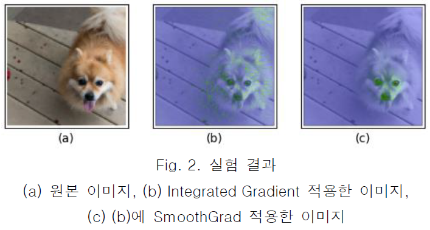

# Analysis and Trend of Attribution Methods for XAI   
   
[한국군사과학기술학회](http://www.kimst.or.kr/) Korea Institute of Military Science and Technology  에서 주관하는 2020 한국군사과학기술학회 종합학술대회에 센서신호 session에 제출한 "XAI를 위한 Attribution Method 접근법 분석 및 동향 Analysis and Trend of Attribution Methods for XAI" 중 3절 실험 파트에서 사용한 코드와 예시를 공개하기 위해 만들었습니다.

## Models & Techniques
해당 논문에서는 Image Classification에서의 XAI 예시를 보기위해 아래의 기법을 사용했습니다.   

Model : Resnet18 (pretrained)   
XAI : Integrated Gradient, SmoothGrad    
demo에서는 위의 두가지 기법만 다루었지만, 이외의 다른 기법도 가능합니다.
그리고 [Captum](https://github.com/pytorch/captum)을 사용했습니다.
    
## Installation

**Installation Requirements**
- Python >= 3.6
- PyTorch >= 1.2
- conda == 4.9.2

#### Installing the latest release

The latest release of Captum is easily installed either via
[Anaconda](https://www.anaconda.com/distribution/#download-section) (recommended):
```bash
conda install captum -c pytorch
```
or via `pip`:
```bash
pip install captum
```

## Sample Outputs


## Reference
XAI를 위한 Attribution Method 접근법 분석 및 동향    
[Axiomatic Attribution for Deep Networks](https://arxiv.org/abs/1703.01365)   
[SmoothGrad: removing noise by adding noise](https://arxiv.org/abs/1706.03825)   

### Author
----------
Joonsang Yoo / [@js-yoo](https://github.com/js-yoo)
